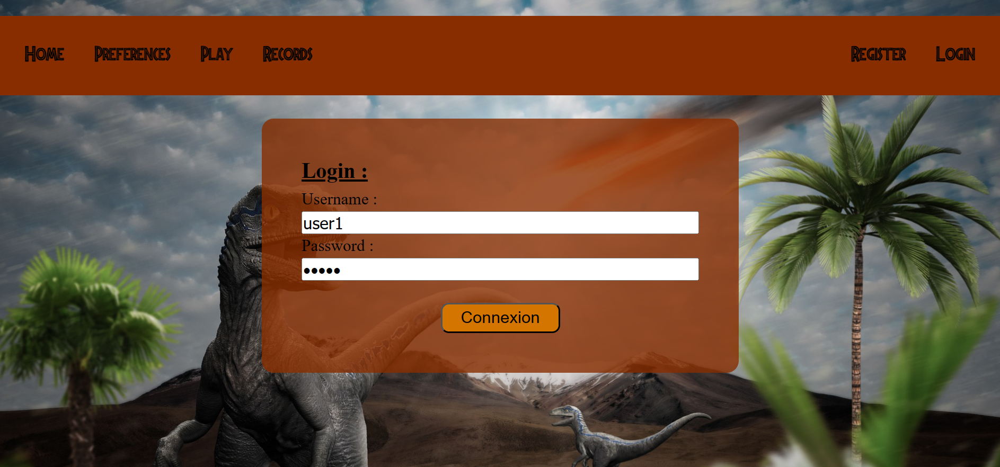

# Ufo Project

This project was generated with [Angular CLI](https://github.com/angular/angular-cli) version 17.0.7.
This is a single page application using routes and components to navigate. This project was realized as part of the Universidad Politecnica de Madrid E.T.S.I.S.I school
Here is a general presentation of the project without going in the details.

## Installation

To install this project :
- Download the repository
- Open a terminal and navigate to the project directory
- Type <code>npm install</code>
- Type <code>ng serve</code>

## The game

The objective is to score points in a limited time. If you miss the target you have -25 and if you hit it it will explode and you'll score 100points.

* Game preview :

You can also change a lot of parameters in "preferences" that will be stored as session variables to add more dinosaurs, improve their speed, change the time limit ...

* Preferences preview :

## Login and register

You can create a new account by filling some informations, your nickname must have less than 9 characters and there is a verification to this. Once someone is registered, with a post request communicating with the API of the schools we create a new user in a server.

* Register preview :

When you registered, you are automatically logged in which means you get a Bearer token with a validity of 10 minutes. But you can also login directly via the following interface.

* Login preview

The token will be renewed if you are active but it will expire and you'll be disconnected if not.
Once you are logged in, the interface changes a little bit allowing you to disconnect, but closing the session will also disconnect you by default.

* Logged in preview

## Scoring

Once you finished your game, if you are logged in, you can decide or not to save your score. To do this, a post request with a valid token in the header is sended to the API of the university. If the token is not valid or expired it will not work and you'll be alerted.

* End preview

You can also visualize the records of other users via the API. Moreover if you are connected, you will have a second table with only your scores.

* Records preview

